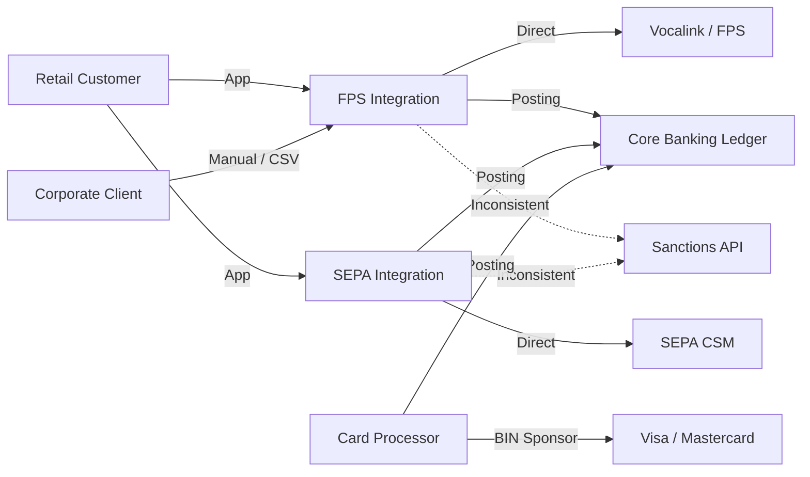
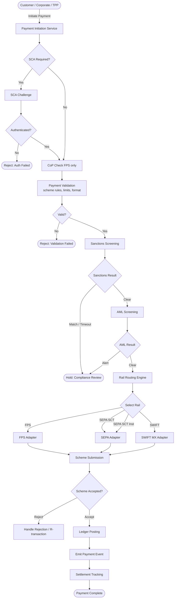
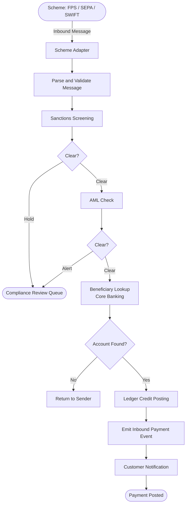
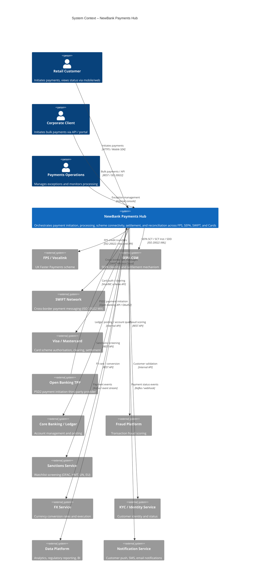
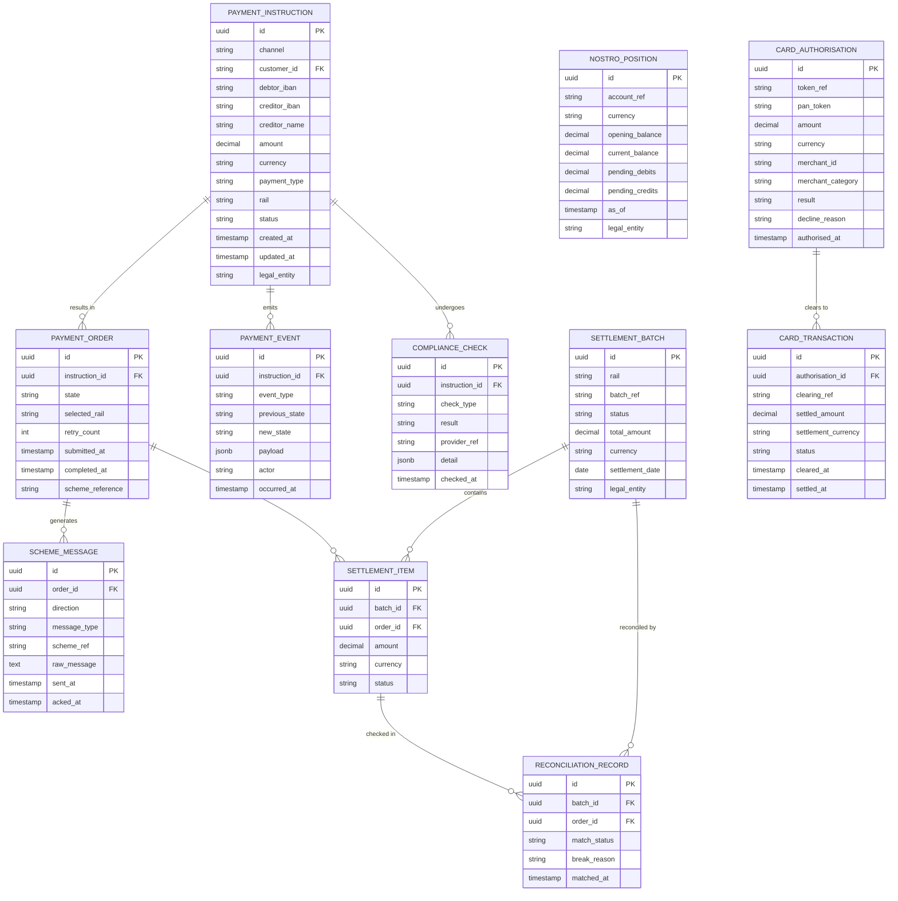

# Solution Architecture Document
# NewBank – Payments Hub

---

## 1. Document Control

| Field     | Value                                                                 |
|-----------|-----------------------------------------------------------------------|
| Title     | NewBank Payments Hub – Solution Architecture Document                 |
| Version   | 0.1 DRAFT                                                             |
| Date      | 2026-03-08                                                            |
| Author    | AI Architect                                                          |
| Reviewers | CTO, Head of Payments, Head of Compliance, Head of Cards, Head of Treasury |
| Status    | Draft – Pending Open Question Resolution                              |

**Revision History**

| Version | Date       | Author       | Change Description                        |
|---------|------------|--------------|-------------------------------------------|
| 0.1     | 2026-03-08 | AI Architect | Initial SAD from engagement kickoff       |

> **Note:** Multiple architecture decisions are pending resolution of open questions from the Engagement Kickoff (OQ-01 through OQ-12). This SAD documents the target architecture based on current best-fit assumptions. Flagged assumptions must be confirmed before Phase 1 delivery commitment.

---

## 2. Executive Summary

### 2.1 Business Objective

NewBank requires a centralised, cloud-native **Payments Hub** to orchestrate fiat currency payments across UK Faster Payments (FPS), SEPA (SCT, SCT Instant, SDD), SWIFT cross-border (ISO 20022 MX), and card issuing (Visa/Mastercard). The current landscape — assumed to have fragmented point-to-point scheme integrations — creates duplicated effort, inconsistent controls, poor operational visibility, and limits NewBank's ability to scale into new markets and rails.

The Payments Hub will deliver a unified, scheme-agnostic orchestration layer covering initiation, routing, processing, settlement, reconciliation, and compliance controls — with bank-grade resilience, security, and regulatory compliance built in from day one.

### 2.2 Scope

**In Scope**
- Payment initiation API (retail, corporate, open banking)
- Payment orchestration and rail routing engine
- FPS scheme connectivity and processing (GBP)
- SEPA SCT and SCT Instant connectivity and processing (EUR)
- SEPA Direct Debit (SDD Core and B2B) — assumed in scope, pending OQ-05
- SWIFT cross-border payments (ISO 20022 MX / CBPR+)
- Card issuing — authorisation, clearing, settlement (Visa/Mastercard)
- Sanctions screening integration (pre-execution, all rails)
- AML / transaction monitoring integration
- Payment status tracking and event emission
- Settlement and nostro position management
- Reconciliation (scheme, nostro, ledger)
- Confirmation of Payee (CoP) — FPS
- Strong Customer Authentication (SCA) — PSD2
- Operational console (exception management, repair, monitoring)
- Regulatory and audit data retention

**Out of Scope**
- Customer onboarding and KYC (consumed as API)
- FX engine / currency conversion (consumed as third-party API — ASM assumed)
- Card acquiring
- Lending and deposit product management
- Core banking / ledger platform (integrated, not built)
- Fraud scoring engine (consumed as API)

### 2.3 Recommendation

Deploy a cloud-native, event-driven Payments Hub on AWS (multi-region: eu-west-2 London, eu-central-1 Frankfurt) using a domain-driven microservices architecture with Apache Kafka as the event backbone. Implement scheme connectivity via a hub-and-spoke adapter pattern, enabling rail-agnostic payment orchestration. Deliver in three phases: Phase 1 (FPS + SEPA SCT), Phase 2 (SCT Inst + SWIFT MX), Phase 3 (SDD + Cards full lifecycle).

### 2.4 Key Decisions

| ADR     | Decision                                              | Status   |
|---------|-------------------------------------------------------|----------|
| ADR-001 | Scheme connectivity model — direct vs. sponsored      | Proposed |
| ADR-002 | Orchestration topology — centralised saga vs. choreography | Proposed |
| ADR-003 | Payment state store — PostgreSQL with event sourcing  | Proposed |
| ADR-004 | Event streaming platform — Apache Kafka (AWS MSK)     | Proposed |
| ADR-005 | Card processing — in-house authorisation vs. third-party processor | Proposed |
| ADR-006 | SWIFT connectivity — Alliance Cloud vs. Service Bureau | Proposed |
| ADR-007 | Cloud provider — AWS multi-region                     | Proposed |
| ADR-008 | FX model — third-party FX API integration             | Proposed |

### 2.5 Key Risks

| Risk | Severity | Mitigation |
|------|----------|------------|
| Scheme certification timelines gate go-live | High | Start SEPA/FPS certification immediately; phase delivery accordingly |
| SWIFT MX migration compliance | High | Adopt ISO 20022 MX natively; no MT legacy path |
| BIN sponsorship model not confirmed (cards) | High | Confirm card scheme access model before cards architecture finalised |
| Nostro liquidity management underestimated | High | Dedicated settlement service with real-time position tracking |
| APP Fraud reimbursement exposure (FPS) | High | CoP + pre-execution fraud scoring; reimbursement reserve |
| Core banking integration latency | Medium | Async ledger posting with idempotent reconciliation |
| Multi-region data residency complexity | Medium | Strict data localisation by payment jurisdiction |

---

## 3. Business Context

### 3.1 Background

NewBank is a fintech challenger bank targeting retail and SME customers across the UK and EU. To compete effectively, NewBank must offer seamless, fast, and low-cost payments across all major domestic and international rails. The absence of a unified payments hub creates fragmented customer experience, high operational cost, and significant regulatory exposure.

### 3.2 Problem Statement

NewBank lacks a centralised payments orchestration capability. Current integrations are assumed to be point-to-point, per-rail, with no canonical payment model, no unified event log, no intelligent routing, and siloed compliance controls. This prevents NewBank from scaling payments volume, onboarding new rails rapidly, or meeting the operational resilience and compliance standards expected of a regulated bank.

### 3.3 Business Goals

| ID    | Goal                                                                              | Priority |
|-------|-----------------------------------------------------------------------------------|----------|
| BG-01 | Deliver a unified payments hub supporting FPS, SEPA, SWIFT, and Cards             | Must     |
| BG-02 | Meet all scheme rule and regulatory compliance obligations from day one            | Must     |
| BG-03 | Achieve 99.99% platform availability for payment processing                       | Must     |
| BG-04 | Enable intelligent rail routing to optimise cost and speed per payment             | Must     |
| BG-05 | Reduce payment operations manual effort by > 80% through automation               | Should   |
| BG-06 | Enable new rail onboarding within 3 months                                        | Should   |
| BG-07 | Provide real-time payment status to customers and internal teams                  | Must     |
| BG-08 | Establish bank-grade audit, data lineage, and retention across all payment flows  | Must     |
| BG-09 | Support open banking payment initiation (PSD2 / UK Open Banking)                  | Must     |
| BG-10 | Enable corporate clients to initiate bulk and API-driven payments                 | Should   |

### 3.4 Success Metrics

| Metric                         | Baseline | Target                    | Measurement            |
|-------------------------------|----------|---------------------------|------------------------|
| FPS end-to-end latency         | N/A      | < 5 seconds               | SLA monitoring (p95)   |
| SEPA SCT Inst end-to-end       | N/A      | < 10 seconds              | SLA monitoring (p95)   |
| SWIFT same-day settlement      | N/A      | 95% within scheme SLA     | Settlement reporting   |
| Card authorisation response    | N/A      | < 200ms (p99)             | APM / scheme reporting |
| Reconciliation auto-match rate | N/A      | > 98%                     | Recon dashboard        |
| Sanctions coverage             | N/A      | 100% pre-execution        | Compliance audit       |
| Manual exception rate          | N/A      | < 1% of transaction volume | Ops reporting          |
| Platform availability          | N/A      | 99.99%                    | SRE uptime monitoring  |
| New rail onboarding time       | N/A      | < 3 months                | Delivery metrics       |

### 3.5 Stakeholders

| Stakeholder              | Role                 | Interest                                              |
|--------------------------|----------------------|-------------------------------------------------------|
| CEO / CPO                | Executive Sponsor    | Strategic capability, time to market, regulatory standing |
| CTO / VP Engineering     | Technical Owner      | Architecture quality, delivery risk, scalability      |
| Head of Payments         | Business Owner       | Scheme compliance, product completeness, customer SLA |
| Head of Compliance / MLRO | Compliance Owner    | AML, sanctions, regulatory reporting                  |
| Head of Treasury         | Treasury Owner       | Nostro funding, intraday liquidity, FX exposure       |
| Head of Cards            | Cards Owner          | Authorisation performance, fraud controls, scheme compliance |
| Engineering Leads        | Delivery             | Technical feasibility, team capacity, CI/CD           |
| External Auditors        | Oversight            | Controls evidence, resilience, scheme compliance      |

### 3.6 Scope Boundary

**In Scope**
- FPS credit transfer (outbound + inbound), returns, CoP
- SEPA SCT and SCT Instant (outbound + inbound)
- SEPA Direct Debit Core and B2B (outbound + inbound), R-transactions
- SWIFT cross-border (ISO 20022 MX CBPR+, outbound + inbound)
- Card issuing: authorisation, clearing, settlement (Visa / Mastercard)
- Payment initiation API (REST), open banking API (PSD2)
- Sanctions screening (pre-execution)
- AML transaction monitoring integration
- Payment routing and orchestration
- Settlement and nostro position management
- Scheme and ledger reconciliation
- Payment event emission and status tracking
- Operational exception management console
- Regulatory audit log and data retention

**Out of Scope**
- Customer onboarding / KYC / AML (consumed as service)
- FX / currency conversion engine (third-party)
- Card acquiring
- Fraud scoring engine (consumed as service)
- Core banking / ledger platform
- Lending and deposit product management
- Regulatory reporting submission (data provided; submission out of scope)

---

## 4. Requirements Baseline

### 4.1 Functional Requirements

| ID    | Requirement                                                                                          | Priority | Source     |
|-------|------------------------------------------------------------------------------------------------------|----------|------------|
| FR-01 | Initiate outbound FPS credit transfers (single and batch) with scheme validation                     | Must     | BG-01      |
| FR-02 | Receive and process inbound FPS credit transfers; post to ledger                                     | Must     | BG-01      |
| FR-03 | Initiate outbound SEPA SCT payments with ISO 20022 pain.001 format                                   | Must     | BG-01      |
| FR-04 | Receive and process inbound SEPA SCT payments (pain.002, camt.054)                                   | Must     | BG-01      |
| FR-05 | Initiate and process outbound SEPA SCT Instant within 10-second SLA                                  | Must     | BG-01      |
| FR-06 | Process inbound SEPA SCT Instant payments                                                            | Must     | BG-01      |
| FR-07 | Originate and process SEPA Direct Debit (SDD Core and B2B) mandates and collections                  | Should   | BG-01/ASM-03 |
| FR-08 | Handle SEPA R-transactions (returns, refunds, reversals, rejects, recalls)                           | Must     | BG-01      |
| FR-09 | Initiate outbound SWIFT cross-border payments using ISO 20022 MX (pacs.008, pacs.009)                | Must     | BG-01      |
| FR-10 | Receive and process inbound SWIFT MX payments; post to ledger                                        | Must     | BG-01      |
| FR-11 | Authorise card transactions in real time with < 200ms response (p99)                                 | Must     | BG-01      |
| FR-12 | Process card clearing files and submit settlement to scheme                                           | Must     | BG-01      |
| FR-13 | Handle card disputes and chargebacks end-to-end                                                       | Should   | BG-01      |
| FR-14 | Route each payment to the optimal rail based on configurable rules (cost, speed, currency, amount)    | Must     | BG-04      |
| FR-15 | Validate payments against scheme rules, velocity limits, and channel controls before submission       | Must     | BG-02      |
| FR-16 | Screen all outbound and inbound payments against sanctions lists (OFAC, UN, HMT, EU) pre-execution   | Must     | BG-02      |
| FR-17 | Submit all transactions to AML transaction monitoring; hold on alert                                  | Must     | BG-02      |
| FR-18 | Track and expose end-to-end payment status to customers, ops, and downstream systems                 | Must     | BG-07      |
| FR-19 | Post payment debit/credit entries to core banking ledger asynchronously with idempotent reconciliation | Must  | BG-01      |
| FR-20 | Reconcile submitted payments against scheme settlement files; identify and flag breaks                | Must     | BG-01      |
| FR-21 | Perform nostro/vostro position management; provide intraday liquidity view to Treasury                | Must     | BG-01      |
| FR-22 | Handle FPS payment returns and recalls                                                                | Must     | BG-02      |
| FR-23 | Support Confirmation of Payee (CoP) for outbound FPS payments                                        | Must     | BG-02      |
| FR-24 | Provide PSD2-compliant payment initiation API for open banking TPPs with SCA                         | Must     | BG-09      |
| FR-25 | Provide corporate bulk payment API (ISO 20022 pain.001 file upload and API)                          | Should   | BG-10      |
| FR-26 | Emit structured payment lifecycle events to data platform (Kafka topic)                               | Must     | BG-08      |
| FR-27 | Provide operational console for payment exception view, repair, and release                           | Must     | BG-05      |
| FR-28 | Enforce per-customer, per-channel, and per-rail payment limits and velocity controls                  | Must     | BG-02      |
| FR-29 | Produce immutable audit log of all payment state transitions and control decisions                    | Must     | BG-08      |
| FR-30 | Support ISO 20022 MX message format natively for SWIFT; no MT legacy path                            | Must     | BG-02      |

### 4.2 Non-Functional Requirements

| ID      | Category      | Requirement                                                          | Target / Threshold               | Design Response                                                               | Trade-offs                              | Validation                        |
|---------|---------------|----------------------------------------------------------------------|----------------------------------|-------------------------------------------------------------------------------|-----------------------------------------|-----------------------------------|
| NFR-01  | Performance   | FPS outbound end-to-end latency                                      | < 5s (p95)                       | Async orchestration with dedicated FPS adapter; Kafka for internal events     | Async adds complexity vs. synchronous   | Load test with synthetic payments |
| NFR-02  | Performance   | SEPA SCT Inst end-to-end latency                                     | < 10s (p95)                      | Priority queue; instant rail adapter; synchronous scheme call path            | Latency budget shared with sanctions    | Scheme SLA monitoring             |
| NFR-03  | Performance   | Card authorisation response time                                     | < 200ms (p99)                    | In-memory authorisation cache; HSM pre-warmed; dedicated card processing pods | Higher infra cost                       | APM / scheme reporting            |
| NFR-04  | Performance   | Payment orchestration throughput                                     | 1,000 TPS sustained; 5,000 TPS peak | Horizontal scaling on EKS; Kafka partitioning                               | Cost at peak vs. reserved capacity      | Performance test                  |
| NFR-05  | Availability  | Payments Hub availability                                            | 99.99% (< 52 min/year)           | Active-active multi-AZ per region; multi-region active-passive               | Significant infra and operational cost  | SRE uptime monitoring             |
| NFR-06  | Availability  | Maintenance windows                                                  | Zero-downtime deployments        | Blue-green / canary deploys on EKS; rolling Kafka broker updates              | Deployment complexity                   | Deployment pipeline tests         |
| NFR-07  | Resilience    | Recovery Time Objective (RTO)                                        | < 15 minutes                     | Multi-AZ failover; automated runbooks; pre-warmed DR                         | Cost of standby capacity                | DR drill (quarterly)              |
| NFR-08  | Resilience    | Recovery Point Objective (RPO)                                       | < 5 minutes                      | Aurora PostgreSQL multi-AZ with PITR; Kafka replication factor 3             | Replication lag under extreme load      | DR drill                          |
| NFR-09  | Resilience    | Graceful degradation under dependency failure                        | Non-critical paths degrade; payments proceed | Circuit breakers on all external calls; fallback to async retry      | Complexity of degraded-mode paths       | Chaos engineering tests           |
| NFR-10  | Scalability   | Volume growth                                                        | 10x current volume without re-architecture | Stateless services on EKS with HPA; Kafka consumer groups                 | Kafka partition planning at design time | Volume ramp testing               |
| NFR-11  | Security      | All inter-service communication encrypted                            | mTLS between all services        | Istio service mesh with mTLS; SPIFFE/SPIRE identity                          | CPU overhead of mTLS (~3%)             | Security scan; penetration test   |
| NFR-12  | Security      | Card data protection                                                 | PCI-DSS v4.0 Level 1 compliant   | Tokenisation at ingress; PCI-scoped network zone; HSM for key ops            | Network segmentation complexity         | QSA PCI audit                     |
| NFR-13  | Security      | Secrets and key management                                           | No hardcoded secrets; HSM for card keys | AWS Secrets Manager; CloudHSM for HSM operations                      | HSM latency adds ~1ms to card auth      | Security review; pen test         |
| NFR-14  | Privacy       | Payment data minimisation and residency                              | EU data in eu-central-1; UK in eu-west-2 | Region-pinned namespaces; no cross-region PII replication             | Complexity of multi-region ops          | Data residency audit              |
| NFR-15  | Privacy       | Personal data retention                                              | 7 years (regulatory minimum)     | Time-partitioned cold storage (S3 Glacier); automated lifecycle policies     | Storage cost at scale                   | Retention policy audit            |
| NFR-16  | Observability | Distributed tracing across all payment flows                         | 100% trace coverage; correlation ID on all events | OpenTelemetry; Jaeger or AWS X-Ray; correlation ID propagated    | Trace storage cost                      | Observability review              |
| NFR-17  | Observability | Business activity monitoring                                         | Real-time dashboard; SLA breach alerts within 60s | Prometheus + Grafana; PagerDuty alerting on SLA metrics          | Dashboard build effort                  | Ops acceptance test               |
| NFR-18  | Compliance    | Sanctions screening coverage                                         | 100% of outbound + inbound payments screened pre-execution | Sanctions adapter in orchestration chain; block-on-failure    | Adds ~50–200ms to payment latency       | Compliance audit; pen test        |
| NFR-19  | Compliance    | Audit log immutability and retention                                 | Immutable; 7-year retention      | Append-only audit log in Aurora; S3 WORM archival                            | Storage cost; query performance at scale | Compliance audit                  |
| NFR-20  | Operability   | Mean time to detect (MTTD) a payment processing failure              | < 2 minutes                      | Real-time alerting on Kafka lag, error rates, SLA breach                     | Alert fatigue if threshold too low      | SRE acceptance test               |

### 4.3 Constraints

| ID     | Constraint                                                              | Type        | Impact                                              |
|--------|-------------------------------------------------------------------------|-------------|-----------------------------------------------------|
| CON-01 | SWIFT ISO 20022 MX (CBPR+) is mandatory — no MT legacy path            | Regulatory  | SWIFT adapter must be MX-native; no MT translation  |
| CON-02 | FPS APP Fraud reimbursement obligations are live (PSR)                  | Regulatory  | CoP and pre-execution fraud controls mandatory      |
| CON-03 | PCI-DSS v4.0 compliance required for card data handling                 | Regulatory  | Network segmentation, tokenisation, HSM mandatory   |
| CON-04 | EU payment data must remain in EU region (GDPR / data residency)        | Regulatory  | Multi-region AWS deployment; no EU data in UK region |
| CON-05 | UK payment data must remain in UK region                                | Regulatory  | Symmetric constraint to CON-04                      |
| CON-06 | Scheme certification required before go-live (SEPA, FPS, SWIFT)        | Delivery    | Certification timelines gate go-live; start early   |
| CON-07 | Cloud-first deployment; on-prem only for HSM                            | Technology  | All services on AWS; CloudHSM or on-prem HSM only   |
| CON-08 | Open source stack preferred (Kafka, PostgreSQL, Kubernetes)             | Technology  | No proprietary ESB or middleware                    |

### 4.4 Assumptions

| ID     | Assumption                                                                                  | Owner               | Risk if Wrong                                          |
|--------|--------------------------------------------------------------------------------------------|---------------------|--------------------------------------------------------|
| ASM-01 | NewBank is greenfield or early-stage on payments; no legacy hub to migrate                 | CTO                 | Transition architecture needed; significant added complexity |
| ASM-02 | Card scope is issuing only (not acquiring)                                                  | Head of Cards       | Acquiring adds significant scope; separate SAD required |
| ASM-03 | SEPA Direct Debit (Core and B2B) is in scope                                               | Head of Payments    | SDD may be descoped to Phase 3; adjust delivery plan   |
| ASM-04 | Cloud provider is AWS; regions eu-west-2 (London) and eu-central-1 (Frankfurt)             | CTO                 | If GCP/Azure, platform choices change (MSK → Pub/Sub etc.) |
| ASM-05 | NewBank holds or is acquiring FCA (UK) and NCB (EU) payment institution licences           | Legal / Compliance  | Sponsored access changes connectivity and SLA architecture |
| ASM-06 | Scheme access for FPS will be via a sponsor bank (Vocalink indirect)                        | Head of Payments    | Direct access changes connectivity model and latency profile |
| ASM-07 | SEPA access is via a CSM (Clearing and Settlement Mechanism) partner, not direct ECB        | Head of Payments    | Direct ECB/TIPS access changes connectivity design     |
| ASM-08 | Card issuing is via BIN sponsorship with a principal member (Visa/MC), not direct membership | Head of Cards     | Direct membership changes liability, latency, and processing model |
| ASM-09 | Core banking / ledger platform is in place and provides a synchronous posting API          | CTO                 | Async ledger or absent ledger changes reconciliation design significantly |
| ASM-10 | Fraud scoring and sanctions screening are consumed as external API services                 | Head of Compliance  | If in-house build, adds major scope                    |
| ASM-11 | FX conversion is provided by a third-party FX API for SWIFT cross-border                   | Head of Treasury    | In-house FX engine is a separate programme             |
| ASM-12 | SWIFT connectivity will be via SWIFT Alliance Cloud (not Service Bureau)                    | CTO                 | Service Bureau changes operational model               |

### 4.5 Dependencies

| ID     | Dependency                          | Type     | Owner              | Status    |
|--------|--------------------------------------|----------|--------------------|-----------|
| DEP-01 | FPS sponsor bank connectivity        | External | Head of Payments   | TBC       |
| DEP-02 | SEPA CSM partner connectivity        | External | Head of Payments   | TBC       |
| DEP-03 | SWIFT Alliance Cloud access          | External | CTO                | TBC       |
| DEP-04 | Card BIN sponsor agreement (Visa/MC) | External | Head of Cards      | TBC       |
| DEP-05 | Core banking / ledger API            | Internal | CTO                | Assumed in place |
| DEP-06 | Sanctions screening API              | External | Head of Compliance | TBC       |
| DEP-07 | Fraud scoring API                    | External | Head of Compliance | TBC       |
| DEP-08 | FX rates / conversion API            | External | Head of Treasury   | TBC       |
| DEP-09 | AWS account and landing zone         | Internal | CTO / Infra        | TBC       |
| DEP-10 | CloudHSM provisioning (PCI zone)     | Internal | CTO / Infra        | TBC       |
| DEP-11 | KYC / identity API                   | Internal | Head of Compliance | Assumed in place |

### 4.6 Open Questions

| ID    | Question                                                                     | Owner               | Due | Status |
|-------|------------------------------------------------------------------------------|---------------------|-----|--------|
| OQ-01 | Is FPS scheme access direct (Vocalink) or via a sponsor bank?                | Head of Payments    | TBC | Open   |
| OQ-02 | Is card issuing via direct scheme membership or BIN sponsorship?             | Head of Cards       | TBC | Open   |
| OQ-03 | Which core banking / ledger platform is in use?                              | CTO                 | TBC | Open   |
| OQ-04 | Cloud provider confirmed as AWS?                                             | CTO                 | TBC | Open   |
| OQ-05 | Is SEPA Direct Debit in scope? SDD Core, B2B, or both?                      | Head of Payments    | TBC | Open   |
| OQ-06 | Is card acquiring in scope?                                                  | Head of Cards       | TBC | Open   |
| OQ-07 | Is FX / currency conversion in-house or third-party?                        | Head of Treasury    | TBC | Open   |
| OQ-08 | Are fraud and sanctions platforms existing or greenfield?                   | Head of Compliance  | TBC | Open   |
| OQ-09 | Target go-live date and phasing?                                             | CPO / Programme     | TBC | Open   |
| OQ-10 | NewBank EU entity status and NCB licence?                                    | Legal / Compliance  | TBC | Open   |
| OQ-11 | SWIFT connectivity: Alliance Cloud or Service Bureau?                        | CTO                 | TBC | Open   |
| OQ-12 | Data residency requirements for EU vs. UK payment data?                     | Legal / DPO         | TBC | Open   |

---

## 5. Current State Architecture

### 5.1 Current State Summary

> Based on ASM-01, NewBank is assumed to be in a greenfield or early-stage state for payments, with no production-grade centralised hub. The following reflects the assumed current state.

### 5.2 Current Systems (Assumed)

| System            | Purpose                    | Limitations                                               |
|-------------------|----------------------------|-----------------------------------------------------------|
| Core Banking      | Account management, ledger | Payment posting API assumed; real-time capability TBC     |
| Point-to-point FPS | FPS credit transfers       | No orchestration layer; manual ops                        |
| SEPA integration  | Basic SCT                  | Not SCT Inst capable; no SDD                              |
| Card processor    | Basic card issuing         | Assumed BIN sponsor arrangement; limited in-house control |
| Sanctions API     | Pre-screening               | May be inconsistently applied across rails                |

### 5.3 Current Integration Landscape

### 5.4 Current Pain Points

| Pain Point                                | Business Impact                          | Priority |
|------------------------------------------|------------------------------------------|----------|
| No centralised orchestration             | Duplicated rail logic; slow to add rails | Critical |
| Fragmented reconciliation                | Settlement breaks; high ops cost         | Critical |
| Siloed sanctions / fraud controls         | Compliance exposure; inconsistent coverage | Critical |
| No real-time payment status tracking      | Poor CX; ops cannot monitor              | High     |
| SWIFT not production-ready (ISO 20022 MX) | Non-compliant with CBPR+ obligations     | Critical |
| No intraday liquidity view               | Treasury funding risk                    | High     |
| Manual exception handling                | SLA breaches; high operational cost      | High     |

---

## 6. Target State Architecture Overview

### 6.1 Architecture Summary

The NewBank Payments Hub is a cloud-native, event-driven platform deployed on AWS across two regions (eu-west-2 London, eu-central-1 Frankfurt). It implements a hub-and-spoke architecture where a central **Payment Orchestration Service** manages the payment lifecycle state machine, coordinating a set of domain-specific services and scheme adapters. Apache Kafka (AWS MSK) is the event backbone, providing decoupling, auditability, and replay. All external scheme interactions are encapsulated behind pluggable rail adapters, enabling new rails to be added without changes to the orchestration core.

### 6.2 Guiding Principles

| Principle                          | Rationale                                                                  |
|------------------------------------|----------------------------------------------------------------------------|
| Scheme-agnostic orchestration      | Payment lifecycle logic must not contain rail-specific code                |
| Event-driven by default            | All payment state transitions emit events; no silent mutations             |
| Compliance as first-class citizen  | Sanctions, AML, and audit are mandatory steps, not optional enrichments    |
| Idempotency everywhere             | All services and adapters must be idempotent; duplicate-safe               |
| Data sovereignty by design         | EU and UK data never co-mingled; region-pinned from ingress                |
| Least privilege                    | Every service has the minimum IAM and network access required              |
| Observable by default              | Every service emits structured logs, metrics, and traces from day one      |
| Fail safe, not fail open           | On uncertainty (sanctions timeout, fraud system unavailable), hold payment |

### 6.3 Target Operating Concept

A payment initiated via any channel (mobile app, corporate API, open banking TPP) enters the Payment Initiation Service, which validates the request, enforces SCA where required, and applies CoP (FPS). The Payment Orchestration Service receives the validated instruction and drives it through a state machine: sanctions check → AML check → limit check → routing decision → scheme submission → settlement → ledger posting → reconciliation. Each state transition emits a Kafka event. Inbound payments arrive via scheme adapters, are validated and screened, then posted to ledger with events emitted for downstream consumers. Cards are handled by the Card Processing Service on a separate PCI-scoped path. The Reconciliation Service continuously matches scheme settlement files against the internal payment state store. An Operational Console provides exceptions view, manual repair, and release for Payments Operations staff.

### 6.4 Key Design Choices

| Decision Area              | Choice                                              | Rationale                                                  |
|----------------------------|-----------------------------------------------------|------------------------------------------------------------|
| Orchestration model        | Centralised saga orchestrator (not choreography)    | Easier auditability, state visibility, exception handling  |
| Event backbone             | Apache Kafka (AWS MSK)                              | Ordering guarantees per partition, replay, durability      |
| Payment state store        | PostgreSQL (Aurora) with event sourcing pattern     | ACID, query flexibility, point-in-time recovery            |
| Scheme adapters            | Hub-and-spoke pluggable adapters per rail           | Rail isolation; new rail = new adapter, no core changes    |
| Card processing zone       | Isolated PCI network zone with separate data store  | PCI-DSS v4.0 scope reduction                               |
| Cross-region strategy      | Active-passive (UK primary, EU secondary DR)        | Simplified ops vs. active-active; cost/resilience balance  |
| API gateway                | Kong (or AWS API Gateway)                           | OAuth2, rate limiting, mTLS termination, audit logging     |
| Service mesh               | Istio with mTLS                                     | Zero-trust inter-service; certificate management           |

---

## 7. Business Architecture

### 7.1 Business Capabilities Impacted

| Capability                        | Current Maturity | Target Maturity | Change Type       |
|-----------------------------------|-----------------|-----------------|-------------------|
| Payment Initiation                | Partial (FPS only) | Full (all rails, all channels) | Extend |
| Payment Orchestration             | None             | Full            | New               |
| Rail Routing and Optimisation     | None             | Full            | New               |
| Scheme Connectivity (FPS/SEPA/SWIFT) | Partial       | Full            | Extend + New      |
| Card Issuing and Authorisation    | Partial          | Full lifecycle  | Extend            |
| Sanctions Screening               | Partial          | Full coverage   | Extend            |
| AML Transaction Monitoring        | Partial          | Full coverage   | Extend            |
| Settlement and Nostro Management  | Manual / partial | Automated       | Transform         |
| Reconciliation                    | Manual           | Automated (>98%) | Transform        |
| Payment Status and Notifications  | Limited          | Real-time, all channels | New        |
| Operational Exception Management  | Manual           | Tool-assisted   | Transform         |
| Regulatory Audit and Reporting    | Fragmented       | Centralised     | Transform         |

### 7.2 Target Business Process — Outbound Payment

### 7.3 Target Business Process — Inbound Payment

### 7.4 Actors and Personas

| Actor                  | Type     | Interactions with Hub                                            |
|------------------------|----------|------------------------------------------------------------------|
| Retail Customer        | External | Payment initiation (app/web); status notifications              |
| SME / Corporate Client | External | Bulk payment API; status webhooks; account reporting            |
| Open Banking TPP       | External | PSD2 payment initiation API; consent management                 |
| Payments Operations    | Internal | Exception console; manual repair and release; monitoring        |
| Compliance / MLRO      | Internal | Sanctions hold review; AML escalation; SAR submission           |
| Treasury Manager       | Internal | Nostro position dashboard; liquidity alerts                     |
| Finance / Recon        | Internal | Reconciliation dashboard; break investigation                   |
| SRE / Engineering      | Internal | Observability dashboards; incident response; deployments        |
| FPS / Vocalink         | External | Scheme message exchange; settlement                             |
| SEPA CSM               | External | Scheme message exchange; SCT/SDD settlement                     |
| SWIFT Network          | External | MX message exchange; correspondent bank instructions            |
| Visa / Mastercard      | External | Card authorisation; clearing; settlement                        |
| Core Banking System    | System   | Account validation; ledger posting; balance queries             |
| Fraud Platform         | System   | Pre-execution scoring; real-time fraud signal                   |
| Sanctions Service      | System   | Pre-execution screening; watchlist match                        |

### 7.5 Control Points

| Control                            | Type        | Owner             | Automated / Manual |
|------------------------------------|-------------|-------------------|--------------------|
| SCA enforcement (PSD2)             | Preventive  | Payment Initiation | Automated          |
| Confirmation of Payee (FPS)        | Preventive  | Payment Initiation | Automated          |
| Scheme rule validation             | Preventive  | Orchestration     | Automated          |
| Payment limit enforcement          | Preventive  | Orchestration     | Automated          |
| Sanctions screening (pre-execution) | Preventive | Compliance        | Automated + Manual review on hit |
| AML transaction monitoring         | Detective   | Compliance        | Automated + Manual review on alert |
| Fraud scoring integration          | Preventive  | Fraud             | Automated + Manual review on alert |
| Duplicate payment detection        | Preventive  | Orchestration     | Automated          |
| Nostro sufficiency check           | Preventive  | Settlement        | Automated          |
| Reconciliation break detection     | Detective   | Reconciliation    | Automated alert; manual investigation |
| Audit log write                    | Detective   | All services      | Automated          |
| Exception queue review             | Corrective  | Payments Ops      | Manual             |
| Sanctions hold release             | Corrective  | Compliance MLRO   | Manual             |

---

## 8. Application Architecture

### 8.1 C4 Level 1 – System Context

### 8.2 C4 Level 2 – Container Diagram

```mermaid
C4Container
    title Container Diagram – NewBank Payments Hub

    Person(retail, "Retail / Corp / TPP", "External initiators")
    Person(ops, "Payments Ops", "Internal console users")

    System_Boundary(hub, "NewBank Payments Hub") {
        Container(apigw, "API Gateway", "Kong / AWS API GW", "TLS termination, OAuth2, rate limiting, routing, audit log")
        Container(init, "Payment Initiation Service", "Java / Kotlin", "Validates initiation requests, enforces SCA, CoP, creates PaymentInstruction")
        Container(orch, "Payment Orchestration Service", "Java / Kotlin", "Drives payment lifecycle state machine; coordinates all downstream services")
        Container(router, "Routing Engine", "Java / Kotlin", "Selects optimal rail per payment; applies routing rules")
        Container(fps_adp, "FPS Adapter", "Java / Kotlin", "Formats and submits FPS messages; handles inbound FPS; scheme rule validation")
        Container(sepa_adp, "SEPA Adapter", "Java / Kotlin", "ISO 20022 pain/pacs/camt; SCT, SCT Inst, SDD; R-transaction handling")
        Container(swift_adp, "SWIFT MX Adapter", "Java / Kotlin", "ISO 20022 MX pacs.008/009; SWIFT Alliance Cloud integration")
        Container(card_svc, "Card Processing Service", "Java / Kotlin", "Real-time card authorisation; clearing; settlement; PCI-scoped")
        Container(comp_adp, "Compliance Adapter", "Java / Kotlin", "Orchestrates sanctions and AML calls; hold-on-failure logic")
        Container(settle, "Settlement Service", "Java / Kotlin", "Settlement batch management; nostro position tracking; intraday liquidity")
        Container(recon, "Reconciliation Service", "Java / Kotlin", "Matches scheme files vs. internal state; detects breaks; raises alerts")
        Container(notif_svc, "Notification Service", "Java / Node", "Emits customer and webhook notifications on payment events")
        Container(ops_console, "Operational Console", "React / Next.js", "Exception view, repair, release for Payments Operations")
        Container(kafka, "Event Bus", "Apache Kafka (AWS MSK)", "Payment lifecycle events; ordered per payment ID; DLQ per topic")
        ContainerDb(pay_db, "Payment State Store", "Aurora PostgreSQL", "Canonical payment state; event sourcing log; audit trail")
        ContainerDb(card_db, "Card Data Store", "Aurora PostgreSQL (PCI zone)", "Tokenised card data; authorisation records; PCI-scoped")
        ContainerDb(recon_db, "Reconciliation Store", "Aurora PostgreSQL", "Settlement files; match results; break records")
    }

    System_Ext(fps, "FPS / Vocalink", "")
    System_Ext(sepa, "SEPA CSM", "")
    System_Ext(swift_net, "SWIFT Network", "")
    System_Ext(card_scheme, "Visa / MC Scheme", "")
    System_Ext(core, "Core Banking", "")
    System_Ext(sanc, "Sanctions API", "")
    System_Ext(fraud_api, "Fraud API", "")
    System_Ext(data_plat, "Data Platform", "")

    Rel(retail, apigw, "HTTPS / REST")
    Rel(ops, ops_console, "HTTPS")
    Rel(apigw, init, "REST")
    Rel(init, orch, "Kafka: payment.initiated")
    Rel(orch, router, "sync call")
    Rel(orch, comp_adp, "sync call: screen payment")
    Rel(orch, fps_adp, "Kafka: payment.routed.fps")
    Rel(orch, sepa_adp, "Kafka: payment.routed.sepa")
    Rel(orch, swift_adp, "Kafka: payment.routed.swift")
    Rel(orch, settle, "Kafka: payment.submitted")
    Rel(orch, pay_db, "Read/Write payment state")
    Rel(orch, kafka, "Emit lifecycle events")
    Rel(fps_adp, fps, "ISO 20022 / Vocalink API")
    Rel(sepa_adp, sepa, "ISO 20022 XML / HTTPS")
    Rel(swift_adp, swift_net, "MX / Alliance Cloud")
    Rel(card_svc, card_scheme, "Authorisation / clearing")
    Rel(card_svc, card_db, "Read/Write")
    Rel(comp_adp, sanc, "REST: screen")
    Rel(comp_adp, fraud_api, "REST: score")
    Rel(settle, core, "Ledger posting API")
    Rel(recon, recon_db, "Read/Write")
    Rel(kafka, data_plat, "Event stream")
    Rel(kafka, notif_svc, "payment.completed events")
```

### 8.3 Bounded Contexts

| Bounded Context          | Domain Type  | Owned By          | Key Aggregates / Concepts                              |
|--------------------------|-------------|-------------------|--------------------------------------------------------|
| Payment Initiation       | Core         | Payments Eng      | PaymentRequest, PaymentInstruction, SCA, CoP           |
| Payment Orchestration    | Core         | Payments Eng      | PaymentOrder, PaymentLifecycle, PaymentState machine   |
| Routing                  | Core         | Payments Eng      | RoutingDecision, RailRule, CostModel                   |
| FPS Connectivity         | Supporting   | Scheme Eng        | FPSMessage, SchemeResponse, FPSReturn                  |
| SEPA Connectivity        | Supporting   | Scheme Eng        | SEPAMessage, RTransaction, MandateRecord               |
| SWIFT Connectivity       | Supporting   | Scheme Eng        | MXMessage, CBPRInstruction, CorrespondentRoute         |
| Card Processing          | Core         | Cards Eng         | CardAuthorisation, CardTransaction, CardToken          |
| Compliance               | Supporting   | Compliance Eng    | SanctionsResult, AMLAlert, ComplianceHold              |
| Settlement               | Core         | Settlement Eng    | SettlementBatch, NostroPosition, FundingInstruction    |
| Reconciliation           | Supporting   | Settlement Eng    | ReconciliationRecord, SettlementFile, Break            |
| Notification             | Generic      | Platform Eng      | PaymentStatusEvent, NotificationChannel                |
| Operational Console      | Generic      | Platform Eng      | ExceptionCase, RepairAction, AuditEntry                |

### 8.4 Application Components

| Component                   | Responsibility                                                 | Technology          | Key Dependencies              |
|-----------------------------|---------------------------------------------------------------|---------------------|-------------------------------|
| API Gateway                 | TLS, OAuth2/mTLS, rate limit, routing, audit log              | Kong / AWS API GW   | Secrets Manager, CloudWatch   |
| Payment Initiation Service  | Request validation, SCA, CoP, instruction creation            | Java / Kotlin / Spring | KYC API, Payment DB, Kafka |
| Payment Orchestration Service | State machine, saga coordination, lifecycle management      | Java / Kotlin / Spring | Kafka, Payment DB, all adapters |
| Routing Engine              | Rail selection logic; cost/speed/currency rules               | Java / Kotlin       | Orchestration, config store   |
| Compliance Adapter          | Sanctions + AML orchestration; hold logic; audit              | Java / Kotlin       | Sanctions API, Fraud API, Kafka |
| FPS Adapter                 | FPS message format, Vocalink API, returns, CoP validation     | Java / Kotlin       | Vocalink API, Kafka, Payment DB |
| SEPA Adapter                | ISO 20022 XML, CSM integration, SCT/SCT Inst/SDD, R-transactions | Java / Kotlin    | CSM API, Kafka, Payment DB    |
| SWIFT MX Adapter            | pacs.008/009 MX, Alliance Cloud, CBPR+, correspondent routing | Java / Kotlin       | Alliance Cloud, Kafka, FX API |
| Card Processing Service     | Real-time auth, tokenisation, clearing, settlement, disputes  | Java / Kotlin       | Card DB, CloudHSM, Visa/MC API |
| Settlement Service          | Settlement batches, nostro position, ledger posting calls     | Java / Kotlin       | Core Banking API, Kafka, Settlement DB |
| Reconciliation Service      | Scheme file ingestion, matching, break detection, alerting    | Java / Kotlin       | Recon DB, Kafka, Payment DB   |
| Notification Service        | Payment status events → customer / webhook                   | Java / Node.js      | Kafka, Notification Platform  |
| Operational Console         | Exception view, repair, release, monitoring UI                | React / Next.js     | Payment DB, Kafka, Auth       |

### 8.5 Key API Catalogue

| API                             | Path                          | Method   | Consumer           | Auth          | SLA     |
|---------------------------------|-------------------------------|----------|--------------------|---------------|---------|
| Initiate Payment                | /v1/payments                  | POST     | Mobile / Web / Corp | OAuth2 + SCA  | < 500ms |
| Get Payment Status              | /v1/payments/{id}             | GET      | All channels       | OAuth2        | < 100ms |
| Initiate Bulk Payment           | /v1/bulk-payments             | POST     | Corporate          | OAuth2 mTLS   | < 2s    |
| Open Banking Payment Initiation | /open-banking/v3/payments     | POST     | TPP                | OAuth2 eIDAS  | < 1s    |
| Open Banking Payment Status     | /open-banking/v3/payments/{id}| GET      | TPP                | OAuth2        | < 200ms |
| Card Authorisation (internal)   | /internal/v1/card/authorise   | POST     | Card Scheme Adapter | mTLS          | < 150ms |
| Confirm Payee                   | /v1/cop/confirm               | POST     | Initiation Svc     | mTLS          | < 300ms |
| Nostro Position (internal)      | /internal/v1/nostro/position  | GET      | Treasury Console   | mTLS + RBAC   | < 200ms |
| Exception List (internal)       | /internal/v1/exceptions       | GET      | Ops Console        | OAuth2 + RBAC | < 500ms |
| Release Payment (internal)      | /internal/v1/payments/{id}/release | POST | Ops / Compliance  | OAuth2 + RBAC | < 500ms |

---

## 9. Data Architecture

### 9.1 Logical Data Model (ERD)

### 9.2 Business Entities

| Entity               | Description                                              | Domain Owner      | Privacy Class | Retention  |
|----------------------|----------------------------------------------------------|-------------------|---------------|------------|
| PaymentInstruction   | Canonical payment intent from any channel                | Orchestration     | Restricted    | 7 years    |
| PaymentOrder         | Scheme-specific execution record                         | Orchestration     | Restricted    | 7 years    |
| PaymentEvent         | Immutable audit log of all state transitions             | Orchestration     | Restricted    | 7 years    |
| SchemeMessage        | Raw inbound/outbound scheme messages                     | Scheme Adapters   | Restricted    | 7 years    |
| ComplianceCheck      | Sanctions and AML check results per payment              | Compliance        | Restricted    | 7 years    |
| SettlementBatch      | Scheme settlement batch (daily or intraday)              | Settlement        | Internal      | 7 years    |
| NostroPosition       | Intraday nostro balance per currency and entity          | Settlement        | Internal      | 7 years    |
| ReconciliationRecord | Match result per settlement item                         | Reconciliation    | Internal      | 7 years    |
| CardAuthorisation    | Real-time card auth decision (tokenised PAN)             | Card Processing   | PCI / Restricted | 7 years  |
| CardTransaction      | Cleared and settled card transaction                     | Card Processing   | PCI / Restricted | 7 years  |

### 9.3 Data Stores

| Store             | Type          | Technology              | Data Held                          | Backup              | Encryption at Rest |
|-------------------|---------------|-------------------------|------------------------------------|---------------------|---------------------|
| Payment State DB  | OLTP          | Aurora PostgreSQL (Multi-AZ) | Payment instructions, orders, events | Automated + PITR | AES-256 (KMS)      |
| Card Data DB      | OLTP (PCI)    | Aurora PostgreSQL (PCI zone) | Tokenised card data, auth records | Automated + PITR | AES-256 (CloudHSM) |
| Recon DB          | OLTP          | Aurora PostgreSQL       | Settlement files, match results    | Automated + PITR    | AES-256 (KMS)      |
| Event Bus         | Streaming     | AWS MSK (Kafka)         | All payment lifecycle events       | Kafka replication x3 | TLS in transit    |
| Audit Archive     | Cold          | S3 Glacier (WORM)       | Archived payment events, 7yr+      | S3 versioning       | AES-256 (KMS)      |
| Config Store      | Key-value     | AWS Parameter Store     | Routing rules, limits, feature flags | Replication       | AES-256 (KMS)      |
| Secrets Store     | Secrets       | AWS Secrets Manager     | API keys, DB credentials, certs    | Managed by AWS      | AES-256 (KMS)      |

### 9.4 Data Lineage and Reconciliation

Payment data originates at initiation (PaymentInstruction), flows through orchestration (PaymentOrder + events), is submitted to the scheme (SchemeMessage), and settles via SettlementBatch → SettlementItem. The Reconciliation Service matches SettlementItems against scheme-provided settlement files. Any unmatched items generate ReconciliationRecord with break_reason. Ledger entries in Core Banking are correlated via scheme_reference. All events are emitted to Kafka with a canonical `correlation_id` = `instruction_id`, enabling end-to-end traceability across all systems.

Data flows downstream to the Data Platform via Kafka event stream for regulatory reporting, analytics, and BI. No direct DB access is granted to the Data Platform.

### 9.5 Key Domain Events

| Event Name                    | Producer                  | Consumers                              | Delivery     | Ordering     |
|-------------------------------|---------------------------|----------------------------------------|--------------|--------------|
| payment.instruction.created   | Initiation Service        | Orchestration, Compliance, Audit       | At-least-once | Per instruction_id |
| payment.sanctions.cleared     | Compliance Adapter        | Orchestration                          | At-least-once | Per instruction_id |
| payment.sanctions.held        | Compliance Adapter        | Orchestration, Ops Console             | At-least-once | Per instruction_id |
| payment.routed                | Orchestration             | Rail Adapters, Audit                   | At-least-once | Per instruction_id |
| payment.scheme.submitted      | Rail Adapters             | Settlement, Orchestration              | At-least-once | Per instruction_id |
| payment.scheme.accepted       | Rail Adapters             | Orchestration, Settlement              | At-least-once | Per instruction_id |
| payment.scheme.rejected       | Rail Adapters             | Orchestration, Ops Console             | At-least-once | Per instruction_id |
| payment.ledger.posted         | Settlement Service        | Orchestration, Notification, Data Platform | At-least-once | Per instruction_id |
| payment.completed             | Orchestration             | Notification Service, Data Platform    | At-least-once | Per instruction_id |
| payment.failed                | Orchestration             | Notification Service, Ops Console      | At-least-once | Per instruction_id |
| settlement.batch.created      | Settlement Service        | Reconciliation, Data Platform          | At-least-once | Per batch       |
| reconciliation.break.detected | Reconciliation Service    | Ops Console, Alerting                  | At-least-once | Per batch       |
| card.authorisation.approved   | Card Processing           | Notification, Ledger, Data Platform    | At-least-once | Per auth_id     |
| card.authorisation.declined   | Card Processing           | Notification, Data Platform            | At-least-once | Per auth_id     |

### 9.6 Master Data and Reference Data Dependencies

| Data                  | Source System   | Owner              | Sync Mechanism              |
|-----------------------|-----------------|--------------------|-----------------------------|
| Customer account data | Core Banking    | Core Banking team  | Real-time API query          |
| Customer KYC status   | KYC Service     | Compliance         | API query at initiation      |
| Routing rules         | Config Store    | Payments Eng       | Admin UI + Parameter Store   |
| Payment limits        | Config Store    | Payments / Risk    | Admin UI + Parameter Store   |
| BIC / IBAN directory  | SWIFT / EPC     | Scheme Adapters    | Scheduled download + cache   |
| Sort code directory   | Pay.UK          | FPS Adapter        | Scheduled download + cache   |
| FX rates              | FX Service      | Treasury           | Real-time API (with cache)   |
| Sanctions lists       | Sanctions Service | Compliance        | Managed by Sanctions provider |
| Card BIN table        | Card BIN Sponsor | Cards Eng          | Scheduled sync               |

---

## 10. Security Architecture

### 10.1 Trust Boundaries

The Payments Hub operates across four trust zones:

1. **Public Zone** — external clients (customers, corporates, TPPs) access via API Gateway over TLS 1.3. No direct service access.
2. **DMZ / API Layer** — API Gateway enforces OAuth2 / mTLS, rate limiting, WAF, and audit logging before traffic reaches internal services.
3. **Internal Services Zone** — all microservices communicate over mTLS (Istio service mesh). No service-to-service plaintext. RBAC via Kubernetes RBAC + Istio AuthorizationPolicy.
4. **PCI-Scoped Zone** — Card Processing Service and Card Data Store are isolated in a separate VPC subnet with strict ingress/egress controls. No non-PCI service can directly access this zone.

Scheme connectivity (FPS, SEPA, SWIFT) uses dedicated outbound-only network paths with IP allowlisting and mutual TLS / leased line where required.

### 10.2 Identity and Access Management

| Actor                  | Authentication Method               | Authorisation Model        | MFA Required |
|------------------------|-------------------------------------|---------------------------|--------------|
| Retail Customer        | OAuth2 / OIDC (app); SCA (biometric/OTP) | ABAC on account ownership | Yes (SCA)   |
| Corporate Client       | OAuth2 mTLS client certificate      | RBAC (admin, maker, checker) | Yes        |
| Open Banking TPP       | OAuth2 + eIDAS QSEAL certificate    | Scoped consent token       | Per PSD2 SCA |
| Payments Operations    | SSO (SAML / OIDC) + MFA             | RBAC (view, repair, release) | Yes        |
| Compliance / MLRO      | SSO + MFA                           | RBAC (view, release holds) | Yes          |
| Service-to-Service     | mTLS (SPIFFE/SPIRE identity)        | Istio AuthorizationPolicy  | N/A          |
| AWS Infra / Ops        | AWS IAM Roles (no long-lived keys)  | Least-privilege IAM roles  | AWS MFA      |

### 10.3 Encryption

| Layer                     | In Transit       | At Rest               | Key Management      | Rotation    |
|---------------------------|------------------|-----------------------|---------------------|-------------|
| Public API                | TLS 1.3          | N/A                   | ACM (AWS)           | Auto        |
| Inter-service (Istio)     | mTLS (TLS 1.3)   | N/A                   | SPIFFE/SPIRE certs  | 24h cert TTL |
| Payment State DB          | TLS              | AES-256 (AWS KMS)     | KMS CMK             | Annual      |
| Card Data DB (PCI)        | TLS              | AES-256 (CloudHSM)    | CloudHSM HSM key    | Annual / PCI |
| Card PAN (tokenisation)   | N/A              | Tokenised at ingress  | CloudHSM            | N/A (token) |
| Kafka / MSK               | TLS              | AES-256 (KMS)         | KMS CMK             | Annual      |
| S3 Audit Archive          | TLS              | AES-256 (KMS)         | KMS CMK             | Annual      |
| Scheme network (FPS/SEPA/SWIFT) | TLS / leased line | N/A            | Scheme-managed      | Per scheme  |

### 10.4 Security Controls

| Control                         | Type        | Implemented By            | Maps To                    |
|---------------------------------|-------------|---------------------------|----------------------------|
| WAF (SQL injection, XSS, OWASP) | Preventive  | AWS WAF on API GW         | PCI DSS 6.4, OWASP Top 10  |
| DDoS protection                 | Preventive  | AWS Shield Standard/Advanced | Operational resilience    |
| OAuth2 + SCA enforcement        | Preventive  | API Gateway + Auth Service | PSD2, PCI                  |
| mTLS inter-service              | Preventive  | Istio service mesh        | Zero trust, PCI 4.0        |
| PCI-scoped network isolation    | Preventive  | VPC segmentation          | PCI DSS 1.3                |
| HSM for card key operations     | Preventive  | AWS CloudHSM              | PCI DSS 3.7                |
| PAN tokenisation at ingress     | Preventive  | Card Processing Service   | PCI DSS 3.5                |
| Secrets rotation                | Preventive  | AWS Secrets Manager       | PCI DSS 8.3                |
| Immutable audit log             | Detective   | All services → Aurora     | PCI DSS 10.2, FCA/PRA      |
| SIEM integration                | Detective   | CloudWatch → SIEM         | PCI DSS 10.6               |
| Vulnerability scanning          | Preventive  | SAST / DAST in CI/CD      | PCI DSS 6.3                |
| Penetration testing             | Detective   | Annual + post-major-change | PCI DSS 11.4, FCA          |
| Segregation of duties           | Preventive  | RBAC + 4-eyes (MLRO release) | AML, FCA, PCI            |

### 10.5 Threat Model Summary (STRIDE)

| Threat                                         | Category      | Likelihood | Impact | Mitigation                                     |
|-----------------------------------------------|---------------|------------|--------|------------------------------------------------|
| Fraudulent payment initiation (account takeover) | Spoofing    | High       | High   | SCA, OAuth2, device binding, fraud scoring     |
| API abuse / payment injection by TPP           | Tampering     | Medium     | High   | eIDAS cert validation, consent scoping, rate limiting |
| Sanctions bypass via mule accounts             | Tampering     | Medium     | High   | Pre-execution sanctions + AML on all flows     |
| Sensitive payment data exfiltration            | Info Disclosure | Medium    | Critical | mTLS, PCI zone isolation, tokenisation       |
| Card PAN theft                                 | Info Disclosure | Medium    | Critical | Tokenisation at ingress; PCI zone; HSM       |
| Replay of payment message                      | Repudiation   | Medium     | High   | Idempotency keys; scheme reference deduplication |
| Kafka message tampering                        | Tampering     | Low        | High   | mTLS on Kafka; schema registry enforcement    |
| Ops console privilege escalation               | Elevation     | Low        | High   | RBAC; 4-eyes for release; MFA                 |
| SWIFT MX message interception                  | Info Disclosure | Low       | Critical | Alliance Cloud TLS; SWIFT security controls  |

### 10.6 Audit Logging

| Event                              | Log Destination            | Retention | SIEM |
|------------------------------------|----------------------------|-----------|------|
| All payment state transitions      | Aurora (audit log) + S3    | 7 years   | Yes  |
| All API requests (inbound)         | API Gateway access log     | 7 years   | Yes  |
| All sanctions / AML check results  | Aurora (compliance log)    | 7 years   | Yes  |
| Card authorisation decisions       | Card DB + S3               | 7 years   | Yes  |
| All admin / ops actions (console)  | CloudTrail + Aurora        | 7 years   | Yes  |
| AWS infrastructure events          | CloudTrail                 | 7 years   | Yes  |
| All inter-service calls (Istio)    | Istio access log           | 90 days   | Yes  |

---

## 11. Infrastructure Architecture

### 11.1 Hosting Model

Cloud-native deployment on **AWS**, multi-region:
- **Primary:** eu-west-2 (London) — UK payments (FPS, SWIFT outbound, Cards)
- **Secondary:** eu-central-1 (Frankfurt) — EU payments (SEPA SCT/Inst/SDD)
- **DR:** Active-passive; automated failover via Route53 health checks and Lambda automation
- **PCI Zone:** Isolated VPC subnets within each region for Card Processing and Card Data Store
- **HSM:** AWS CloudHSM cluster per region (PCI zone) for card key management

On-premises components: none by default. SWIFT connectivity via Alliance Cloud (cloud-hosted). FPS connectivity via sponsor bank API (HTTPS). SEPA connectivity via CSM partner API.

### 11.2 Infrastructure Diagram

```mermaid
graph TD
    subgraph Internet
        CUS[Customers / TPPs / Corporates]
    end

    subgraph AWS eu-west-2 London - Primary
        subgraph Public Subnet
            WAF[AWS WAF + Shield]
            ALB[Application Load Balancer]
        end

        subgraph Private Subnet - Services
            APIGW[API Gateway Kong]
            EKS_UK[EKS Cluster - UK Services]
            MSK_UK[MSK Kafka - UK]
            subgraph PCI Zone - UK
                CARD_UK[Card Processing Service]
                CARD_DB_UK[(Card DB Aurora PCI)]
                HSM_UK[CloudHSM Cluster]
            end
        end

        subgraph Private Subnet - Data
            PAY_DB_UK[(Payment State DB Aurora Multi-AZ)]
            RECON_DB_UK[(Reconciliation DB Aurora)]
            S3_UK[S3 Audit Archive WORM]
        end

        subgraph Egress Zone - UK
            FPS_GW[FPS Sponsor Bank Gateway]
            SWIFT_GW[SWIFT Alliance Cloud Connector]
        end
    end

    subgraph AWS eu-central-1 Frankfurt - EU
        subgraph Private Subnet - Services EU
            EKS_EU[EKS Cluster - EU Services]
            MSK_EU[MSK Kafka - EU]
            subgraph PCI Zone EU
                CARD_EU[Card Processing EU]
                CARD_DB_EU[(Card DB Aurora PCI EU)]
                HSM_EU[CloudHSM EU]
            end
        end

        subgraph Private Subnet - Data EU
            PAY_DB_EU[(Payment State DB Aurora EU)]
            S3_EU[S3 Audit Archive EU WORM]
        end

        subgraph Egress Zone EU
            SEPA_GW[SEPA CSM Gateway]
        end
    end

    subgraph External Schemes
        FPS_NET[FPS Vocalink]
        SEPA_NET[SEPA CSM]
        SWIFT_NET[SWIFT Network]
        CARD_SCHEME[Visa Mastercard]
    end

    CUS -->|HTTPS| WAF
    WAF --> ALB
    ALB --> APIGW
    APIGW --> EKS_UK
    EKS_UK --> MSK_UK
    EKS_UK --> PAY_DB_UK
    EKS_UK --> RECON_DB_UK
    EKS_UK --> CARD_UK
    CARD_UK --> CARD_DB_UK
    CARD_UK --> HSM_UK
    EKS_UK -->|HTTPS TLS| FPS_GW
    EKS_UK -->|SWIFT MX| SWIFT_GW
    FPS_GW -->|ISO 20022| FPS_NET
    SWIFT_GW -->|MX| SWIFT_NET
    CARD_UK -->|Auth| CARD_SCHEME

    EKS_EU --> MSK_EU
    EKS_EU --> PAY_DB_EU
    EKS_EU --> CARD_EU
    CARD_EU --> CARD_DB_EU
    CARD_EU --> HSM_EU
    EKS_EU -->|ISO 20022 XML| SEPA_GW
    SEPA_GW -->|ISO 20022| SEPA_NET

    MSK_UK -.->|Cross-region replication select topics| MSK_EU

    EKS_UK --> S3_UK
    EKS_EU --> S3_EU
```

### 11.3 Compute and Platform

| Component                | Platform         | Sizing (initial)       | Scaling       | HA                  |
|--------------------------|------------------|------------------------|---------------|---------------------|
| API Gateway              | Kong on EKS      | 3 pods x 2 vCPU/4GB    | HPA (RPS)     | Multi-AZ pod spread |
| Payment Orchestration    | EKS              | 4 pods x 4 vCPU/8GB    | HPA (TPS)     | Multi-AZ            |
| SEPA / FPS Adapters      | EKS              | 3 pods x 2 vCPU/4GB    | HPA (queue depth) | Multi-AZ         |
| SWIFT Adapter            | EKS              | 2 pods x 2 vCPU/4GB    | Manual scale  | Multi-AZ            |
| Card Processing          | EKS (PCI zone)   | 4 pods x 4 vCPU/8GB    | HPA (TPS)     | Multi-AZ            |
| Settlement Service       | EKS              | 2 pods x 2 vCPU/4GB    | Vertical      | Multi-AZ            |
| Reconciliation Service   | EKS              | 2 pods x 4 vCPU/8GB    | Scheduled scale (batch) | Multi-AZ |
| Payment State DB         | Aurora PostgreSQL | r6g.xlarge x 2 (Multi-AZ) | Read replicas | Multi-AZ auto-failover |
| Card DB                  | Aurora PostgreSQL | r6g.large x 2 (PCI)   | Read replicas | Multi-AZ auto-failover |
| Kafka (MSK)              | MSK kafka.m5.xlarge | 3 brokers (replication=3) | Partition scale | Multi-AZ        |
| CloudHSM                 | AWS CloudHSM     | 2 HSMs per cluster     | Manual scale  | HA cluster          |

### 11.4 HA / DR

| Service                  | HA Model              | RPO        | RTO         | DR Strategy                              |
|--------------------------|-----------------------|------------|-------------|------------------------------------------|
| Payment Orchestration    | Multi-AZ pods         | < 5 min    | < 15 min    | Cross-region standby; Route53 failover   |
| Card Processing          | Multi-AZ PCI pods     | < 5 min    | < 15 min    | Cross-region PCI standby                 |
| Payment State DB         | Aurora Multi-AZ       | < 1 min    | < 5 min     | PITR + cross-region Aurora Global DB     |
| Card DB                  | Aurora Multi-AZ (PCI) | < 1 min    | < 5 min     | PITR + cross-region replica              |
| Kafka (MSK)              | Multi-AZ 3 brokers    | ~0 (replicated) | < 10 min | Cross-region topic replication (select)  |
| API Gateway              | Multi-AZ pods         | N/A        | < 5 min     | Multi-region active-passive              |
| SEPA Adapter             | Multi-AZ pods         | < 5 min    | < 15 min    | EU-region only; no UK DR needed          |
| SWIFT Adapter            | Multi-AZ pods         | < 5 min    | < 15 min    | Alliance Cloud has own HA                |

### 11.5 Environment Strategy

| Environment | Purpose                                | Data Policy                        | Refresh    |
|-------------|----------------------------------------|------------------------------------|------------|
| Dev         | Development; unit/integration tests   | Synthetic data only                | On-demand  |
| SIT         | System integration testing            | Synthetic + scheme sandbox data    | Sprint end |
| UAT         | Scheme certification; business sign-off | Scheme sandbox; masked prod sample | Milestone  |
| PreProd     | Final regression; performance testing | Anonymised prod-like data          | Pre-release |
| Production  | Live payments                         | Real customer data; full controls  | N/A        |

---

## 12. Integration and Interface Design

### 12.1 Interface Catalogue

| ID     | Source               | Target               | Pattern    | Protocol     | Frequency     | Auth          | Error Handling       | SLA       |
|--------|----------------------|----------------------|------------|--------------|---------------|---------------|----------------------|-----------|
| INT-01 | Initiation Service   | Orchestration        | Event      | Kafka        | Per payment   | mTLS          | DLQ on failure       | N/A       |
| INT-02 | Orchestration        | FPS Adapter          | Event      | Kafka        | Per payment   | mTLS          | Retry x3, then DLQ   | N/A       |
| INT-03 | Orchestration        | SEPA Adapter         | Event      | Kafka        | Per payment   | mTLS          | Retry x3, then DLQ   | N/A       |
| INT-04 | Orchestration        | SWIFT Adapter        | Event      | Kafka        | Per payment   | mTLS          | Retry x3, then DLQ   | N/A       |
| INT-05 | FPS Adapter          | Vocalink / FPS       | Sync REST  | HTTPS/ISO20022 | Per payment | mTLS cert     | Retry x2, circuit breaker | < 3s |
| INT-06 | SEPA Adapter         | SEPA CSM             | Sync/Batch | HTTPS/ISO20022 XML | Per payment + batch | mTLS | Retry x2, then DLQ | < 8s (SCT Inst) |
| INT-07 | SWIFT Adapter        | SWIFT Alliance Cloud | Sync MX    | SWIFT MX     | Per payment   | SWIFT auth    | Retry x2, manual on fail | Scheme SLA |
| INT-08 | Card Processing      | Visa / MC Scheme     | Sync       | Scheme API   | Per auth      | Scheme cert   | Timeout = decline    | < 150ms   |
| INT-09 | Settlement Service   | Core Banking         | Sync REST  | HTTPS/REST   | Per payment   | mTLS + OAuth2 | Retry x3, idempotent | < 500ms   |
| INT-10 | Compliance Adapter   | Sanctions API        | Sync REST  | HTTPS/REST   | Per payment   | API Key / mTLS | Timeout = hold (fail-safe) | < 200ms |
| INT-11 | Compliance Adapter   | Fraud API            | Sync REST  | HTTPS/REST   | Per payment   | mTLS          | Timeout = pass-through + flag | < 100ms |
| INT-12 | Orchestration        | Core Banking (acct)  | Sync REST  | HTTPS/REST   | Per payment   | mTLS          | Retry x2             | < 200ms   |
| INT-13 | Reconciliation       | Scheme settlement file | Batch ingest | SFTP / S3  | Daily + intraday | TLS / S3 IAM | Alert on missing file | Batch window |
| INT-14 | All services         | Data Platform        | Event      | Kafka        | Real-time     | mTLS          | DLQ; replay supported | N/A      |
| INT-15 | SWIFT Adapter        | FX Service           | Sync REST  | HTTPS/REST   | Per cross-border | mTLS        | Fail on unavailable  | < 200ms   |

### 12.2 Error Handling and DLQ Strategy

All Kafka consumers implement:
- **Retry:** 3 attempts with exponential backoff (1s, 5s, 30s)
- **DLQ:** Failed messages routed to `<topic>.dlq` topic after exhausted retries
- **DLQ monitoring:** Alert on DLQ depth > 0; Ops Console shows DLQ messages with repair action
- **Poison message handling:** DLQ messages are acknowledged and quarantined; manual review and release required

All synchronous external calls implement:
- **Retry:** 2 attempts with backoff
- **Circuit breaker:** Resilience4j; open after 5 failures in 30 seconds; half-open after 60 seconds
- **Fail-safe defaults:** Sanctions timeout → hold payment (never skip); Fraud timeout → flag + pass; Core Banking timeout → async retry queue

### 12.3 Idempotency and Ordering

- Every PaymentInstruction carries an `idempotency_key` set by the initiating channel; duplicate submissions return the existing instruction without reprocessing
- All scheme adapters are idempotent: re-submission of the same instruction_id is detected via scheme_reference check
- Kafka topics are keyed by `instruction_id` to guarantee ordering of events per payment
- Card authorisations use the scheme-provided `retrieval_reference_number` for idempotency

---

## 13. Non-Functional Architecture

### 13.1 Performance

| Scenario                        | Throughput (TPS) | Latency p95  | Peak Load     | Design Response                                         |
|---------------------------------|-----------------|--------------|---------------|----------------------------------------------------------|
| FPS outbound e2e                | 200 TPS         | < 5 seconds  | 1,000 TPS     | Async Kafka pipeline; dedicated FPS adapter pods         |
| SEPA SCT Inst e2e               | 100 TPS         | < 10 seconds | 500 TPS       | Priority Kafka partition; synchronous CSM call path      |
| SWIFT cross-border              | 20 TPS          | < 60 seconds | 100 TPS       | Async; SWIFT SLA governs; pre-validation for speed       |
| Card authorisation              | 500 TPS         | < 200ms p99  | 2,000 TPS     | In-memory state; HSM pre-warmed; dedicated card pods     |
| Payment initiation API          | 500 TPS         | < 500ms      | 2,000 TPS     | Stateless pods; HPA on API Gateway and Initiation Svc   |
| Reconciliation batch            | N/A             | < 2hr window | Daily batch   | Scheduled scale; parallel matching workers              |

### 13.2 Scalability

All payment processing services are stateless and horizontally scalable on EKS via Kubernetes HPA, triggered on CPU utilisation and custom Kafka consumer lag metrics. Kafka partitions are pre-provisioned for 10x current peak volume per topic. Aurora PostgreSQL scales read capacity via read replicas; write scaling via Aurora Serverless v2 (burstable) for non-card stores. The PCI-scoped card processing zone scales independently of the non-PCI path. A 10x volume growth target is achievable without architectural changes — only compute and partition scaling required.

### 13.3 Resilience

| Mechanism               | Implementation                        | Scope                        |
|------------------------|---------------------------------------|------------------------------|
| Circuit breaker         | Resilience4j on all external calls    | Sanctions, Fraud, Core Banking, Schemes |
| Bulkhead                | Separate thread pools per rail adapter | FPS, SEPA, SWIFT, Cards      |
| Retry with backoff      | Resilience4j + Kafka retry topic      | All scheme adapters          |
| DLQ                     | Kafka DLQ per consumer topic          | All Kafka consumers          |
| Graceful degradation    | Fraud timeout → pass + flag; Notif failure → queue | Non-critical paths |
| Pod disruption budgets  | Min 2 pods always available per service | All EKS services           |
| Multi-AZ deployment     | Pod anti-affinity rules               | All services                 |
| Cross-region DR         | Active-passive with Route53 failover  | Full platform                |
| Chaos engineering       | Quarterly game days; AWS Fault Injection Simulator | Full platform     |

### 13.4 Observability

| Signal  | Tool                        | Coverage                           | Retention | Alerting                              |
|---------|-----------------------------|------------------------------------|-----------|---------------------------------------|
| Logs    | Structured JSON → CloudWatch | All services + scheme adapters     | 90 days hot; 7yr S3 cold | CloudWatch Alarms; PagerDuty  |
| Metrics | Prometheus + Grafana        | TPS, latency, error rate, Kafka lag | 30 days   | PagerDuty on SLA breach / lag        |
| Traces  | OpenTelemetry + AWS X-Ray   | 100% of payment flows              | 30 days   | Sampling increase on error spike     |
| BAM     | Grafana (payment event stream) | Payment volumes, rail SLAs, recon rate | 7 days real-time | Ops team alerts on SLA breach  |
| Audit   | Aurora (immutable) + S3 WORM | All state transitions, control decisions | 7 years | N/A (compliance evidence)       |

Correlation ID (`instruction_id`) is propagated as a header on all inter-service calls and embedded in all log entries, enabling full end-to-end trace reconstruction for any payment.

### 13.5 Compliance Controls

| Regulation            | Obligation                                   | Control                                         | Evidence                        |
|-----------------------|----------------------------------------------|--------------------------------------------------|----------------------------------|
| PSD2 / UK PSR         | SCA on retail payment initiation              | SCA enforcement in Initiation Service            | Auth log; scheme audit          |
| PSD2 / UK PSR         | TPP access with consent                       | eIDAS cert + OAuth2 consent scoping              | API Gateway access log          |
| FPS / Pay.UK          | Confirmation of Payee                         | CoP call at initiation                           | CoP response log per payment    |
| UK PSR APP Fraud      | Pre-execution fraud controls                  | Fraud scoring; CoP; velocity limits              | Fraud API response log          |
| SEPA EPC              | ISO 20022 scheme rule compliance              | SEPA Adapter schema validation                   | Scheme acceptance log           |
| SWIFT CBPR+           | ISO 20022 MX (pacs.008/009)                  | SWIFT MX Adapter; no MT fallback                 | SWIFT message log               |
| AML / AMLD6           | Transaction monitoring, SAR                   | AML API integration; hold on alert               | AML check log; compliance audit |
| Sanctions (all)       | Pre-execution screening                       | Sanctions API; hold on match or timeout          | Sanctions check log             |
| PCI-DSS v4.0          | Card data protection                          | Tokenisation; PCI zone; HSM; QSA audit           | QSA assessment report           |
| GDPR / UK GDPR        | Data minimisation; residency; retention       | Region-pinned deployment; lifecycle policies     | DPO audit; residency report     |
| Op Resilience PRA/FCA | Important business service; impact tolerances | IBS mapping; self-assessment; chaos testing      | Annual resilience self-assessment |
| DORA (EU)             | ICT risk; third-party risk; testing           | Vulnerability management; TLPT; third-party register | DORA register; test reports  |

---

## 14. Deployment and Transition

### 14.1 Phased Delivery Strategy

Given scheme certification requirements and delivery constraints, a phased approach is recommended:

| Phase | Scope                                   | Gate                                        |
|-------|-----------------------------------------|---------------------------------------------|
| Phase 1 | FPS credit transfer + SEPA SCT (outbound + inbound) + Sanctions + Core Banking posting | FPS scheme certification; SEPA CSM certification |
| Phase 2 | SEPA SCT Instant + SWIFT MX cross-border + AML integration + Nostro management | SCT Inst scheme cert; SWIFT CBPR+ cert; SWIFT Alliance Cloud |
| Phase 3 | SDD Core / B2B + Card issuing full lifecycle + CoP + open banking TPP API | Card scheme cert; PCI QSA audit; TPP sandbox test |
| Phase 4 | Reconciliation automation + Corporate bulk payments + Ops console full feature | Business acceptance test |

### 14.2 Migration Strategy

**Strangler fig / parallel run** is recommended. For each rail:
1. Deploy new hub adapter alongside existing integration
2. Route a percentage of traffic to new hub (shadow mode first, then live)
3. Validate scheme settlement and reconciliation match between old and new
4. Cut over 100% to hub; decommission old integration

For greenfield rails (SWIFT MX, SCT Inst): direct go-live — no parallel run required.

### 14.3 Cutover Approach

- Per-rail cutover; not big bang
- FPS cutover: low-risk window (weekend); pre-cut dry run; same-day rollback capability
- SEPA cutover: coordinate with CSM partner; end-of-day cut to avoid in-flight batch
- Cards: card processor switch — BIN sponsor involvement; pre-certification required
- Scheme settlement files: dual-receipt during parallel run period

### 14.4 Rollback Approach

- Feature flags in Config Store enable per-rail instant rollback to legacy integration
- Database migrations are backward-compatible (expand-contract pattern)
- Kafka topics retained for 7 days enabling event replay on rollback
- Card data: rollback requires BIN sponsor coordination; highest risk — plan carefully

### 14.5 Coexistence Period

During Phase 1 and Phase 2 delivery, FPS and SEPA legacy integrations remain in place as fallback. Dual audit trails written. Reconciliation service handles both old and new payment references.

---

## 15. Risks and Issues

| ID     | Risk / Issue                                                          | Category     | Likelihood | Impact | Owner                | Mitigation                                               | Status |
|--------|-----------------------------------------------------------------------|--------------|------------|--------|----------------------|----------------------------------------------------------|--------|
| RSK-01 | Scheme certification (SEPA, FPS, SWIFT) timelines extend delivery     | Delivery     | H          | H      | Head of Payments     | Start certification immediately; phase delivery by rail  | Open   |
| RSK-02 | SWIFT ISO 20022 MX compliance gap                                     | Compliance   | M          | H      | CTO                  | MX-native adapter; no MT path; prioritise in Phase 2    | Open   |
| RSK-03 | BIN sponsorship / card scheme access model not confirmed              | Architecture | H          | H      | Head of Cards        | Resolve OQ-02 before cards architecture is finalised    | Open   |
| RSK-04 | Nostro liquidity management scope underestimated                      | Architecture | M          | H      | Head of Treasury     | Settlement service with real-time position; Treasury UAT | Open   |
| RSK-05 | APP Fraud reimbursement financial exposure (FPS)                      | Compliance   | M          | H      | Head of Compliance   | CoP + fraud scoring + velocity controls mandatory in Phase 1 | Open |
| RSK-06 | Multi-region data residency complexity                                | Regulatory   | M          | H      | DPO / Legal          | Region-pinned architecture; residency audit pre-go-live  | Open   |
| RSK-07 | Core banking integration latency causing payment SLA breach           | Architecture | M          | M      | CTO                  | Async ledger posting with idempotent retry; decouple posting from scheme SLA | Open |
| RSK-08 | Cloud HSM latency impacting card authorisation < 200ms SLA           | Infrastructure | M         | H      | Infra / Cards Eng    | CloudHSM cluster per region; pre-warmed; perf test early | Open   |
| RSK-09 | Sanctions false positive rate causing payment delays                  | Operations   | M          | M      | Head of Compliance   | SLA on screening provider; warm-escalation path          | Open   |
| RSK-10 | Scope creep into acquiring, FX engine, or greenfield fraud platform   | Delivery     | H          | H      | CPO / Programme      | Firm scope boundary; separate SAD per out-of-scope item  | Open   |
| RSK-11 | Kafka consumer lag under peak load causing instant payment SLA breach | Performance  | M          | H      | Payments Eng         | Priority partitions for SCT Inst; lag monitoring + alert | Open   |
| RSK-12 | PCI-DSS QSA audit timeline gates card go-live                         | Delivery     | M          | H      | Head of Cards        | Engage QSA early; design for PCI from day one            | Open   |
| RSK-13 | DORA ICT third-party risk obligations for cloud and scheme connectivity | Compliance  | M          | M      | Head of Compliance   | Third-party register; contractual obligations; exit plans | Open  |

---

## 16. Architecture Decisions Summary

| ADR     | Title                                                          | Status   | Date       |
|---------|----------------------------------------------------------------|----------|------------|
| ADR-001 | Scheme Connectivity Model — Direct vs. Sponsored               | Proposed | 2026-03-08 |
| ADR-002 | Payment Orchestration Topology — Centralised Saga vs. Choreography | Proposed | 2026-03-08 |
| ADR-003 | Payment State Store — Event Sourcing on Aurora PostgreSQL       | Proposed | 2026-03-08 |
| ADR-004 | Event Streaming Platform — Apache Kafka (AWS MSK)              | Proposed | 2026-03-08 |
| ADR-005 | Card Processing Architecture — In-House Authorisation vs. Third-Party Processor | Proposed | 2026-03-08 |
| ADR-006 | SWIFT Connectivity — Alliance Cloud vs. Service Bureau         | Proposed | 2026-03-08 |
| ADR-007 | Cloud Provider and Region Strategy                             | Proposed | 2026-03-08 |
| ADR-008 | FX Model — Third-Party FX API vs. In-House FX Engine           | Proposed | 2026-03-08 |

> See `adr/` directory for individual ADR documents.

---

## 17. Review Outcomes

### Senior Solution Architect Review

**Findings:**
1. The centralised saga orchestrator is the right choice for compliance-critical payment flows where full auditability and state visibility are non-negotiable. Choreography would sacrifice observability for marginal decoupling benefit.
2. The scheme adapter hub-and-spoke pattern correctly isolates rail complexity, but adapter contracts must be strictly versioned to avoid orchestration core changes on rail evolution.
3. The phased delivery approach is correct, but Phase 1 scope (FPS + SEPA SCT) must be treated as an MVP — not a pilot. Bank-grade controls (sanctions, audit, reconciliation) must be production-ready in Phase 1, not bolted on later.
4. Idempotency and deduplication must be validated under failure scenarios — especially Kafka consumer crash mid-processing. Recommend idempotency test suite in CI/CD pipeline.

**Refinements applied:** Idempotency policy section added (12.3). Phase 1 scope clarified to include full compliance controls.

### Security Architect Review

**Findings:**
1. Fail-safe default on sanctions (hold on timeout) is critical and correctly specified. Any relaxation of this during load must be explicitly rejected — document in ADR.
2. PCI-DSS scope reduction via PCI zone isolation is correct, but the blast radius of a PCI zone breach must be assessed. Recommend formal PCI scoping document produced with QSA before build.
3. CloudHSM latency impact on card auth SLA requires formal performance testing with HSM in the critical path. Target < 200ms p99 with HSM adds headroom risk.
4. Istio mTLS CPU overhead (~3%) must be accounted for in capacity planning.
5. Secrets Manager rotation must be tested under automated rotation to prevent service interruption.

**Refinements applied:** Fail-safe defaults documented in 12.2. HSM latency risk added to risk register (RSK-08). PCI QSA risk added (RSK-12).

### Data Architect Review

**Findings:**
1. Event sourcing on Aurora is appropriate for payment state, but the PaymentEvent table will grow very large. Partitioning strategy (by created_at) must be defined before go-live; archival to S3 Glacier must be automated.
2. The ERD correctly separates the payment instruction (intent) from the payment order (execution) and scheme message (wire). This separation of concerns is essential for re-submission, repair, and audit.
3. Master data synchronisation (BIC/IBAN directory, sort codes) must have a staleness SLA — stale data causes payment failures. Cache invalidation strategy must be explicit.
4. Cross-region data — ensure that Kafka cross-region replication (MSK) does NOT replicate PII-carrying topics from EU to UK or vice versa. Topic-level residency policy must be enforced.
5. 7-year retention policy must be accompanied by a deletion/archival SLA — data that grows unboundedly in Aurora will degrade query performance.

**Refinements applied:** Master data staleness noted in 9.6. Cross-region Kafka replication constraint noted in infrastructure. Partitioning and archival added to NFR-15.

### Business Architect Review

**Findings:**
1. The control point table (7.5) correctly identifies the 4-eyes MLRO release control for sanctions holds. This must be reflected in the ops console RBAC model — a compliance officer must not self-approve their own holds.
2. The nostro/vostro position management is critical for Treasury — the real-time intraday position view must be available from Day 1 of SWIFT go-live, not deferred to a later phase.
3. SDD mandate management is a significant business process that is currently under-specified. Before Phase 3 scope is committed, a dedicated process analysis session for SDD origination, mandate registry, and collections lifecycle is recommended.
4. The APP Fraud reimbursement obligation (RSK-05) requires not just technical controls (CoP, fraud scoring) but also an operational reimbursement process. This is a business architecture gap.

**Refinements applied:** 4-eyes RBAC constraint noted in 10.2. Nostro position Day 1 for SWIFT in Phase 2 delivery plan. SDD scoping risk flagged in risk register.

### Infrastructure Architect Review

**Findings:**
1. Active-passive cross-region DR is the right risk/cost balance for a startup fintech. However, the DR runbook must be automated and tested quarterly — manual DR failover at 2am will not meet a 15-minute RTO.
2. MSK partition planning must be done at design time based on projected TPS. Under-partitioned Kafka will create a hard ceiling on throughput that cannot be resolved without downtime.
3. CloudHSM cluster requires a minimum of 2 HSMs per cluster for HA. Ensure both regions are provisioned from day one — a single HSM failure would take cards offline.
4. EKS node groups should use Spot instances for non-PCI workloads to reduce cost, with On-Demand reserved for critical payment processing and PCI workloads.
5. AWS Shield Advanced (not Standard) is required given the payment platform's regulatory and financial sensitivity — DDoS impact on payment availability is a PRA Operational Resilience concern.

**Refinements applied:** CloudHSM HA constraint noted in 11.3 (2 HSMs per cluster). Shield Advanced noted in 10.4. DR automation noted in NFR-07. MSK partition planning risk noted (RSK-11).

---

## 18. Appendices

### Appendix A – Glossary

| Term        | Definition                                                                |
|-------------|---------------------------------------------------------------------------|
| FPS         | UK Faster Payments Service — real-time GBP domestic payments              |
| SEPA        | Single Euro Payments Area — EUR payment framework across EEA              |
| SCT         | SEPA Credit Transfer — standard EUR credit transfer                       |
| SCT Inst    | SEPA Instant Credit Transfer — EUR credit transfer within 10 seconds      |
| SDD         | SEPA Direct Debit — EUR direct debit (Core and B2B variants)              |
| SWIFT       | Society for Worldwide Interbank Financial Telecommunication                |
| MX          | ISO 20022 XML-based SWIFT message format (replacing legacy MT formats)    |
| CBPR+       | Cross-Border Payments and Reporting Plus — SWIFT ISO 20022 MX programme  |
| BIN         | Bank Identification Number — identifies card issuer in card scheme        |
| PAN         | Primary Account Number — the 16-digit card number                        |
| CoP         | Confirmation of Payee — UK scheme to verify payee name against account   |
| SCA         | Strong Customer Authentication — PSD2 requirement for two-factor auth    |
| TPP         | Third-Party Provider — open banking payment initiation provider           |
| CSM         | Clearing and Settlement Mechanism — SEPA scheme infrastructure            |
| HSM         | Hardware Security Module — tamper-resistant key management hardware       |
| Nostro      | "Our money at your bank" — account held at correspondent bank             |
| Vostro      | "Your money at our bank" — correspondent bank's account at NewBank       |
| DLQ         | Dead Letter Queue — destination for unprocessable messages                |
| mTLS        | Mutual TLS — both client and server present certificates                  |
| RBAC        | Role-Based Access Control                                                 |
| ABAC        | Attribute-Based Access Control                                            |
| MLRO        | Money Laundering Reporting Officer                                        |
| SAR         | Suspicious Activity Report                                                |
| EPC         | European Payments Council — SEPA scheme governance body                  |
| QSA         | Qualified Security Assessor — PCI-DSS auditor                            |
| PITR        | Point-in-Time Recovery — database backup capability                      |
| HPA         | Horizontal Pod Autoscaler — Kubernetes autoscaling                        |
| IBS         | Important Business Service — PRA/FCA operational resilience definition   |
| DORA        | EU Digital Operational Resilience Act                                    |
| APP Fraud   | Authorised Push Payment Fraud — customer tricked into sending payment    |

### Appendix B – References

| Reference                                        | Source                                      |
|--------------------------------------------------|---------------------------------------------|
| SEPA Credit Transfer Rulebook v2.0               | European Payments Council (EPC)             |
| SEPA Instant Credit Transfer Rulebook v1.1       | European Payments Council (EPC)             |
| SWIFT CBPR+ Migration Guide                      | swift.com                                   |
| FPS Scheme Rules                                 | Pay.UK                                      |
| PCI DSS v4.0                                     | PCI Security Standards Council              |
| PSD2 / PSR 2017                                  | FCA / European Banking Authority            |
| UK PSR APP Fraud Reimbursement Policy            | PSR.org.uk                                  |
| EBA Guidelines on Outsourcing Arrangements       | European Banking Authority                  |
| PRA Operational Resilience SS1/21                | Prudential Regulation Authority             |
| DORA (EU) 2022/2554                              | EUR-Lex                                     |
| ISO 20022 Message Catalogue                      | ISO / swift.com                             |
| AWS Well-Architected Framework                   | docs.aws.amazon.com                         |

### Appendix C – Architecture Decision Records Index

See `adr/` directory:
- [ADR-001 – Scheme Connectivity Model](adr/ADR-001-scheme-connectivity-model.md)
- [ADR-002 – Orchestration Topology](adr/ADR-002-orchestration-topology.md)
- [ADR-003 – Payment State Store](adr/ADR-003-payment-state-store.md)
- [ADR-004 – Event Streaming Platform](adr/ADR-004-event-streaming-platform.md)
- [ADR-005 – Card Processing Architecture](adr/ADR-005-card-processing-architecture.md)
- [ADR-006 – SWIFT Connectivity](adr/ADR-006-swift-connectivity.md)
- [ADR-007 – Cloud Provider and Region Strategy](adr/ADR-007-cloud-provider-region.md)
- [ADR-008 – FX Model](adr/ADR-008-fx-model.md)

### Appendix D – Outstanding Items Before Architecture Baseline

The following open questions (from ENGAGEMENT-KICKOFF.md) must be resolved before this SAD is baselined:

| OQ    | Impact on SAD                                              |
|-------|------------------------------------------------------------|
| OQ-01 | Scheme connectivity model (ADR-001); FPS adapter design   |
| OQ-02 | Card architecture (ADR-005); PCI scope; BIN sponsor model |
| OQ-03 | Core banking integration design (INT-09); posting API     |
| OQ-04 | Cloud provider confirmation (ADR-007); all infra choices  |
| OQ-05 | SDD scope (Phase 3 sizing and SEPA adapter design)        |
| OQ-06 | Card acquiring (if in scope, separate SAD required)       |
| OQ-07 | FX model (ADR-008); SWIFT adapter design                  |
| OQ-08 | Fraud/sanctions platform selection; INT-10, INT-11        |
| OQ-09 | Phase gating and delivery milestone planning              |
| OQ-10 | EU entity; SEPA access model; DORA applicability          |
| OQ-11 | SWIFT connectivity (ADR-006)                              |
| OQ-12 | Data residency policy confirmation; region routing design |
